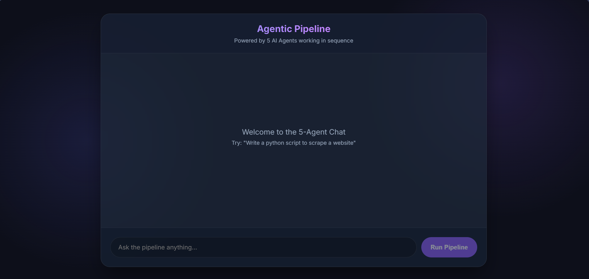
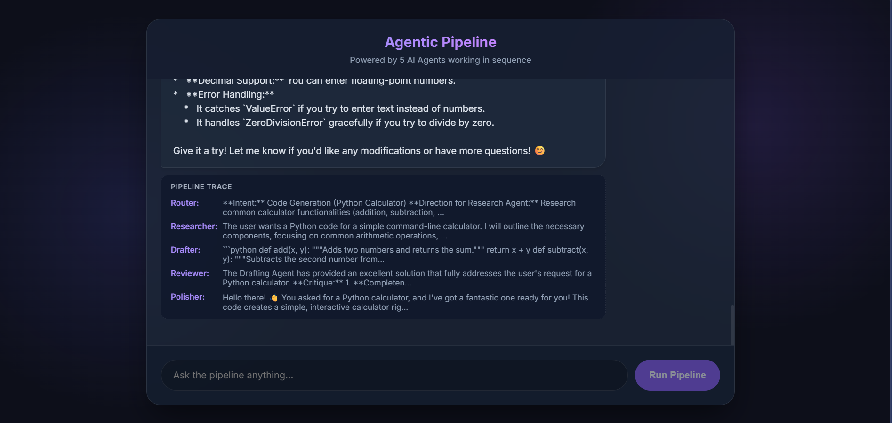
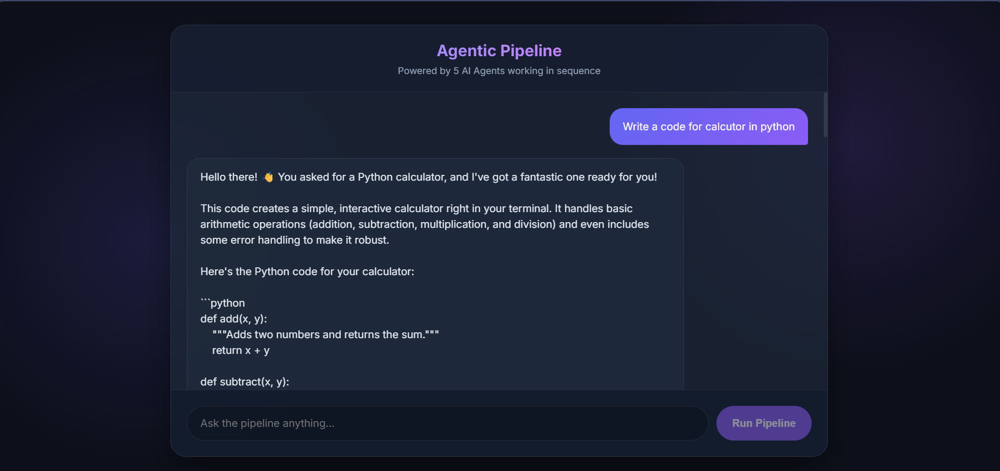

# 5 AI Agents Pipeline & Chatbot UI

A full-stack application that processes user requests through a sequence of 5 specialized AI agents (powered by Google Gemini) and displays the results in a modern, glassmorphic React chat interface.

## 🌟 Overview
Unlike a standard chatbot where a single prompt goes to a single model, this application utilizes an **Agentic Pipeline**. When you send a message, it is passed continuously through 5 distinct "personas", each adding value, refining, or critiquing the output before presenting the final result to you.

### The 5 Agents:
1.  **🔀 Router Agent:** Analyzes your request, classifies intent, and sets a high-level direction.
2.  **🔍 Research Agent:** Takes the direction and expands it into a detailed outline or architectural plan.
3.  **✍️ Drafting Agent:** Writes the primary content (e.g., code, essay, summary) based on the research outline.
4.  **⚖️ Reviewer Agent:** Critically analyzes the draft against the original prompt, identifying flaws or missing pieces, and corrects them.
5.  **✨ Polisher Agent:** Takes the reviewed draft and formats it beautifully for the final UI using Markdown styling.

## 🚀 Features
*   **Sequential AI Pipeline:** Watch the thought process of 5 AI agents.
*   **Pipeline Trace:** The UI displays a collapsible "trace" showing exactly what the Router, Researcher, Drafter, and Reviewer generated before the final output.
*   **Modern UI:** A stunning, responsive chat interface built with React, featuring dark mode, glassmorphism (`backdrop-filter`), animations, and scroll management.
*   **FastAPI Backend:** A lightweight, fast Python backend that orchestrates the Gemini API calls.

## 🛠️ Tech Stack
*   **Backend:** Python, FastAPI, `google-genai` (Gemini 2.5 Flash)
*   **Frontend:** React (Vite), plain CSS (no heavy styling libraries)

## 📸 Screenshots

*(Place these images inside a new `screenshots/` folder in your project root)*

### 1. The Chat Interface

*The main user interface showing the chatbot design.*

### 2. The 5-Agent Pipeline Trace

*Viewing the "thoughts" and outputs of the Router, Researcher, Drafter, and Reviewer.*

### 3. Final Polished Output

*The result formatted beautifully by the Final Polisher agent.*

---

## 💻 Getting Started

### Prerequisites
1.  **Python 3.8+** installed.
2.  **Node.js & npm** installed.
3.  A **Gemini API Key**. Get one from [Google AI Studio](https://aistudio.google.com/).

### 1. Setup Environment
Open your terminal and ensure your Gemini API Key is accessible in your environment.
```bash
# Windows (Command Prompt)
set GEMINI_API_KEY=your_api_key_here

# Windows (PowerShell)
$env:GEMINI_API_KEY="your_api_key_here"

# Mac/Linux
export GEMINI_API_KEY="your_api_key_here"
```

### 2. Run the Application
We have provided a convenient batch script to start both the Python backend and the React frontend simultaneously.

Simply run the script from the root project directory:
```bash
start_app.bat
```
*(Or just double-click `start_app.bat` in your File Explorer if on Windows).*

This script will open two new terminal windows:
1.  **Terminal 1:** Starts the FastAPI server (`uvicorn`) on `http://localhost:8000`.
2.  **Terminal 2:** Starts the React Vite development server on `http://localhost:5173`.

### 3. Usage
Once both servers are running, the Chatbot UI should automatically open in your default browser. 
1. Type a complex prompt (e.g., *"Design a system architecture for a real-time chat app"*).
2. Hit **Run Pipeline**.
3. Wait for the 5 agents to finish processing. 
4. Read the final polished response, and inspect the **Pipeline Trace** block underneath it to see the AI's step-by-step reasoning!

---

## 📂 Project Structure
```text
h:\practicals\AIA\
├── main.py                 # FastAPI backend containing the 5-Agent pipeline logic
├── start_app.bat           # 1-click startup script for both servers
├── requirements.txt        # Python dependencies (fastapi, uvicorn, google-genai)
└── ai-chatbot/             # React Frontend Directory
    ├── src/
    │   ├── App.jsx         # Main Chatbot UI component
    │   ├── App.css         # Styling for the chat container, bubbles, and loader
    │   └── index.css       # Global styles (fonts, variables, background)
    └── package.json        # Node dependencies
```
